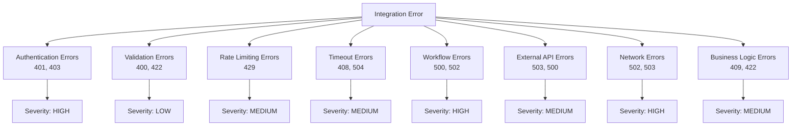

# N8N Integration Error Handling Strategy

## Overview

This document outlines a comprehensive error handling strategy for the N8N integration, covering error classification, recovery mechanisms, monitoring, and user experience considerations.

## Error Classification System

### 1. Error Categories



### 2. Error Code Mapping

| Category | HTTP Status | Error Code | Severity | Auto Retry |
|----------|------------|------------|----------|------------|
| Authentication | 401 | `AUTH_INVALID_TOKEN` | HIGH | No |
| Authentication | 403 | `AUTH_FORBIDDEN` | HIGH | No |
| Validation | 400 | `VALIDATION_FAILED` | LOW | No |
| Validation | 422 | `VALIDATION_BUSINESS_RULE` | MEDIUM | No |
| Rate Limiting | 429 | `RATE_LIMIT_EXCEEDED` | MEDIUM | Yes |
| Timeout | 408 | `REQUEST_TIMEOUT` | MEDIUM | Yes |
| Workflow | 500 | `WORKFLOW_EXECUTION_FAILED` | HIGH | Yes |
| External API | 503 | `EXTERNAL_SERVICE_UNAVAILABLE` | MEDIUM | Yes |
| Network | 502 | `NETWORK_ERROR` | HIGH | Yes |
| Business Logic | 409 | `BUSINESS_CONFLICT` | MEDIUM | No |

## Error Response Standardization

### Standard Error Response Format

```typescript
interface StandardErrorResponse {
  success: false;
  error: {
    code: string;           // Machine-readable error code
    message: string;        // Human-readable message
    details?: string;       // Additional context
    field?: string;         // Field causing validation error
    retryable: boolean;     // Can this error be retried?
    retryAfter?: number;    // Seconds to wait before retry
  };
  statusCode: number;       // HTTP status code
  timestamp: string;        // ISO timestamp
  requestId: string;        // Unique request identifier
  executionId?: string;     // N8N execution ID if available
  supportContact?: string;  // Support information
}
```

### Error Response Examples

#### Authentication Error
```json
{
  "success": false,
  "error": {
    "code": "AUTH_INVALID_TOKEN",
    "message": "Invalid or expired authentication token",
    "details": "The provided bearer token is not valid or has expired. Please refresh your token.",
    "retryable": false
  },
  "statusCode": 401,
  "timestamp": "2025-08-08T12:00:00.000Z",
  "requestId": "req_1691491200_xyz123",
  "supportContact": "support@yourcompany.com"
}
```

#### Rate Limiting Error
```json
{
  "success": false,
  "error": {
    "code": "RATE_LIMIT_EXCEEDED",
    "message": "Too many requests. Please try again later.",
    "details": "You have exceeded the rate limit of 10 requests per minute for trading actions.",
    "retryable": true,
    "retryAfter": 45
  },
  "statusCode": 429,
  "timestamp": "2025-08-08T12:00:00.000Z",
  "requestId": "req_1691491200_xyz123"
}
```

#### Validation Error
```json
{
  "success": false,
  "error": {
    "code": "VALIDATION_FAILED",
    "message": "Invalid request parameters",
    "details": "Symbol must be a valid cryptocurrency pair (e.g., BTCUSD)",
    "field": "symbol",
    "retryable": false
  },
  "statusCode": 400,
  "timestamp": "2025-08-08T12:00:00.000Z",
  "requestId": "req_1691491200_xyz123"
}
```

## Error Handling Implementation

### 1. Client-Side Error Handler

```typescript
// lib/api/error-handler.ts
export class N8NErrorHandler {
  static handleError(error: any): StandardErrorResponse {
    // Network errors
    if (error instanceof TypeError && error.message.includes('fetch')) {
      return {
        success: false,
        error: {
          code: 'NETWORK_ERROR',
          message: 'Network connection failed',
          details: 'Unable to connect to N8N service. Please check your connection.',
          retryable: true,
          retryAfter: 5
        },
        statusCode: 502,
        timestamp: new Date().toISOString(),
        requestId: generateRequestId()
      };
    }
    
    // Timeout errors
    if (error.name === 'AbortError') {
      return {
        success: false,
        error: {
          code: 'REQUEST_TIMEOUT',
          message: 'Request timed out',
          details: 'The request took too long to complete. Please try again.',
          retryable: true,
          retryAfter: 10
        },
        statusCode: 408,
        timestamp: new Date().toISOString(),
        requestId: generateRequestId()
      };
    }
    
    // HTTP errors with response
    if (error.response) {
      return this.handleHttpError(error.response);
    }
    
    // Unknown errors
    return {
      success: false,
      error: {
        code: 'UNKNOWN_ERROR',
        message: 'An unexpected error occurred',
        details: error.message || 'Unknown error',
        retryable: false
      },
      statusCode: 500,
      timestamp: new Date().toISOString(),
      requestId: generateRequestId()
    };
  }
  
  private static handleHttpError(response: Response): StandardErrorResponse {
    const statusCode = response.status;
    
    switch (statusCode) {
      case 401:
        return this.createErrorResponse('AUTH_INVALID_TOKEN', 
          'Authentication failed', statusCode);
      case 403:
        return this.createErrorResponse('AUTH_FORBIDDEN', 
          'Access denied', statusCode);
      case 429:
        return this.createErrorResponse('RATE_LIMIT_EXCEEDED', 
          'Rate limit exceeded', statusCode, true, 60);
      case 500:
        return this.createErrorResponse('WORKFLOW_EXECUTION_FAILED', 
          'Workflow execution failed', statusCode, true, 30);
      case 502:
        return this.createErrorResponse('NETWORK_ERROR', 
          'Service temporarily unavailable', statusCode, true, 15);
      case 503:
        return this.createErrorResponse('EXTERNAL_SERVICE_UNAVAILABLE', 
          'External service unavailable', statusCode, true, 30);
      default:
        return this.createErrorResponse('HTTP_ERROR', 
          `HTTP ${statusCode} error`, statusCode);
    }
  }
  
  private static createErrorResponse(
    code: string, 
    message: string, 
    statusCode: number,
    retryable = false,
    retryAfter?: number
  ): StandardErrorResponse {
    return {
      success: false,
      error: {
        code,
        message,
        retryable,
        retryAfter
      },
      statusCode,
      timestamp: new Date().toISOString(),
      requestId: generateRequestId()
    };
  }
}
```

### 2. Retry Logic Implementation

```typescript
// lib/api/retry-manager.ts
interface RetryConfig {
  maxRetries: number;
  initialDelay: number;
  maxDelay: number;
  backoffFactor: number;
  retryCondition?: (error: any) => boolean;
}

export class RetryManager {
  private static defaultConfig: RetryConfig = {
    maxRetries: 3,
    initialDelay: 1000, // 1 second
    maxDelay: 30000,    // 30 seconds
    backoffFactor: 2
  };
  
  static async executeWithRetry<T>(
    operation: () => Promise<T>,
    config: Partial<RetryConfig> = {}
  ): Promise<T> {
    const finalConfig = { ...this.defaultConfig, ...config };
    let lastError: any;
    
    for (let attempt = 0; attempt <= finalConfig.maxRetries; attempt++) {
      try {
        return await operation();
      } catch (error) {
        lastError = error;
        
        // Don't retry on final attempt
        if (attempt === finalConfig.maxRetries) {
          break;
        }
        
        // Check if error is retryable
        if (finalConfig.retryCondition && !finalConfig.retryCondition(error)) {
          break;
        }
        
        // Check if error response indicates it's retryable
        if (error.retryable === false) {
          break;
        }
        
        // Calculate delay with exponential backoff
        const delay = Math.min(
          finalConfig.initialDelay * Math.pow(finalConfig.backoffFactor, attempt),
          finalConfig.maxDelay
        );
        
        // Use retryAfter from error response if available
        const actualDelay = error.retryAfter ? error.retryAfter * 1000 : delay;
        
        console.warn(`Attempt ${attempt + 1} failed, retrying in ${actualDelay}ms`, error);
        await this.sleep(actualDelay);
      }
    }
    
    throw lastError;
  }
  
  private static sleep(ms: number): Promise<void> {
    return new Promise(resolve => setTimeout(resolve, ms));
  }
}
```

### 3. Circuit Breaker Pattern

```typescript
// lib/api/circuit-breaker.ts
enum CircuitState {
  CLOSED = 'CLOSED',     // Normal operation
  OPEN = 'OPEN',         // Service down, reject requests
  HALF_OPEN = 'HALF_OPEN' // Testing service recovery
}

export class CircuitBreaker {
  private state: CircuitState = CircuitState.CLOSED;
  private failureCount = 0;
  private nextAttempt = Date.now();
  
  constructor(
    private failureThreshold: number = 5,
    private recoveryTimeout: number = 60000, // 1 minute
    private monitorWindow: number = 300000   // 5 minutes
  ) {}
  
  async execute<T>(operation: () => Promise<T>): Promise<T> {
    if (this.state === CircuitState.OPEN) {
      if (Date.now() < this.nextAttempt) {
        throw new Error('Circuit breaker is OPEN - service unavailable');
      }
      this.state = CircuitState.HALF_OPEN;
    }
    
    try {
      const result = await operation();
      this.onSuccess();
      return result;
    } catch (error) {
      this.onFailure();
      throw error;
    }
  }
  
  private onSuccess(): void {
    this.failureCount = 0;
    this.state = CircuitState.CLOSED;
  }
  
  private onFailure(): void {
    this.failureCount++;
    
    if (this.failureCount >= this.failureThreshold) {
      this.state = CircuitState.OPEN;
      this.nextAttempt = Date.now() + this.recoveryTimeout;
    }
  }
  
  getState(): CircuitState {
    return this.state;
  }
}
```

## N8N Workflow Error Handling

### Enhanced Error Handling in N8N Workflows

```javascript
// N8N Error Handler Node
const inputData = $json;
const errorInfo = $json.error || {};

// Classify error type
function classifyError(error) {
  if (error.statusCode) {
    switch (error.statusCode) {
      case 401:
      case 403:
        return 'AUTHENTICATION';
      case 429:
        return 'RATE_LIMIT';
      case 500:
      case 502:
      case 503:
        return 'SERVICE_ERROR';
      case 408:
      case 504:
        return 'TIMEOUT';
      default:
        return 'HTTP_ERROR';
    }
  }
  
  if (error.code === 'ECONNRESET' || error.code === 'ENOTFOUND') {
    return 'NETWORK_ERROR';
  }
  
  return 'UNKNOWN_ERROR';
}

// Determine if error is retryable
function isRetryable(errorType, error) {
  const retryableTypes = ['RATE_LIMIT', 'SERVICE_ERROR', 'TIMEOUT', 'NETWORK_ERROR'];
  return retryableTypes.includes(errorType);
}

// Format standard error response
function formatErrorResponse(error, errorType) {
  const errorMessages = {
    'AUTHENTICATION': 'Authentication failed. Please check your credentials.',
    'RATE_LIMIT': 'Rate limit exceeded. Please wait before making more requests.',
    'SERVICE_ERROR': 'Service temporarily unavailable. Please try again later.',
    'TIMEOUT': 'Request timed out. Please try again.',
    'NETWORK_ERROR': 'Network connection failed. Please check connectivity.',
    'HTTP_ERROR': 'HTTP request failed. Please check request parameters.',
    'UNKNOWN_ERROR': 'An unexpected error occurred.'
  };
  
  return {
    success: false,
    error: {
      code: errorType,
      message: errorMessages[errorType] || 'Unknown error occurred',
      details: error.message || 'No additional details available',
      retryable: isRetryable(errorType, error),
      retryAfter: errorType === 'RATE_LIMIT' ? 60 : undefined
    },
    statusCode: error.statusCode || 500,
    timestamp: new Date().toISOString(),
    executionId: $execution.id,
    workflow: $workflow.name
  };
}

// Process the error
const errorType = classifyError(errorInfo);
const errorResponse = formatErrorResponse(errorInfo, errorType);

// Log error for monitoring
console.error('Workflow error:', {
  errorType,
  executionId: $execution.id,
  workflow: $workflow.name,
  timestamp: new Date().toISOString(),
  error: errorInfo
});

// Send critical errors to monitoring system
if (['AUTHENTICATION', 'SERVICE_ERROR'].includes(errorType)) {
  // Trigger alert workflow
  $('HTTP Request').first().json = {
    action: 'send_notification',
    payload: {
      type: 'system_alert',
      message: `Critical error in ${$workflow.name}: ${errorResponse.error.message}`,
      channels: ['telegram'],
      priority: 'critical'
    }
  };
}

return [{ json: errorResponse }];
```

## Error Recovery Strategies

### 1. Automatic Recovery Mechanisms

```typescript
// lib/api/recovery-manager.ts
export class RecoveryManager {
  private static recoveryStrategies = new Map<string, (error: any) => Promise<any>>();
  
  static registerStrategy(errorCode: string, strategy: (error: any) => Promise<any>) {
    this.recoveryStrategies.set(errorCode, strategy);
  }
  
  static async attemptRecovery(error: StandardErrorResponse): Promise<any> {
    const strategy = this.recoveryStrategies.get(error.error.code);
    
    if (strategy) {
      try {
        return await strategy(error);
      } catch (recoveryError) {
        console.error('Recovery strategy failed:', recoveryError);
        throw error; // Return original error if recovery fails
      }
    }
    
    throw error; // No recovery strategy available
  }
}

// Register recovery strategies
RecoveryManager.registerStrategy('AUTH_INVALID_TOKEN', async (error) => {
  // Attempt token refresh
  const newToken = await refreshAuthToken();
  if (newToken) {
    // Update client with new token
    n8nClient.updateToken(newToken);
    return { recovered: true, newToken };
  }
  throw error;
});

RecoveryManager.registerStrategy('RATE_LIMIT_EXCEEDED', async (error) => {
  // Implement queue-based recovery
  const retryAfter = error.error.retryAfter || 60;
  await new Promise(resolve => setTimeout(resolve, retryAfter * 1000));
  return { recovered: true, waitTime: retryAfter };
});
```

### 2. Fallback Mechanisms

```typescript
// lib/api/fallback-manager.ts
export class FallbackManager {
  static async executeWithFallback<T>(
    primaryOperation: () => Promise<T>,
    fallbackOperation?: () => Promise<T>
  ): Promise<T> {
    try {
      return await primaryOperation();
    } catch (primaryError) {
      console.warn('Primary operation failed, attempting fallback:', primaryError);
      
      if (fallbackOperation) {
        try {
          const result = await fallbackOperation();
          
          // Log successful fallback
          await this.logFallbackSuccess(primaryError, result);
          return result;
        } catch (fallbackError) {
          // Log fallback failure
          await this.logFallbackFailure(primaryError, fallbackError);
          throw primaryError; // Return original error
        }
      }
      
      throw primaryError;
    }
  }
  
  private static async logFallbackSuccess(originalError: any, result: any) {
    console.log('Fallback operation succeeded:', {
      originalError: originalError.message,
      result: typeof result,
      timestamp: new Date().toISOString()
    });
  }
  
  private static async logFallbackFailure(originalError: any, fallbackError: any) {
    console.error('Both primary and fallback operations failed:', {
      originalError: originalError.message,
      fallbackError: fallbackError.message,
      timestamp: new Date().toISOString()
    });
  }
}
```

## Error Monitoring & Alerting

### 1. Error Metrics Collection

```typescript
// lib/monitoring/error-metrics.ts
interface ErrorMetrics {
  totalErrors: number;
  errorsByType: Record<string, number>;
  errorRate: number;
  averageRecoveryTime: number;
  criticalErrors: number;
  lastError: Date | null;
}

export class ErrorMetricsCollector {
  private static metrics: ErrorMetrics = {
    totalErrors: 0,
    errorsByType: {},
    errorRate: 0,
    averageRecoveryTime: 0,
    criticalErrors: 0,
    lastError: null
  };
  
  static recordError(error: StandardErrorResponse): void {
    this.metrics.totalErrors++;
    this.metrics.errorsByType[error.error.code] = 
      (this.metrics.errorsByType[error.error.code] || 0) + 1;
    this.metrics.lastError = new Date();
    
    if (['AUTH_INVALID_TOKEN', 'WORKFLOW_EXECUTION_FAILED'].includes(error.error.code)) {
      this.metrics.criticalErrors++;
    }
    
    // Update error rate (errors per hour)
    this.updateErrorRate();
  }
  
  static getMetrics(): ErrorMetrics {
    return { ...this.metrics };
  }
  
  private static updateErrorRate(): void {
    // Calculate errors in last hour
    const oneHourAgo = new Date(Date.now() - 60 * 60 * 1000);
    // Implementation would query error log for recent errors
    // For now, use simple approximation
    this.metrics.errorRate = this.metrics.totalErrors / 24; // Rough hourly average
  }
  
  static reset(): void {
    this.metrics = {
      totalErrors: 0,
      errorsByType: {},
      errorRate: 0,
      averageRecoveryTime: 0,
      criticalErrors: 0,
      lastError: null
    };
  }
}
```

### 2. Alert System Integration

```typescript
// lib/monitoring/alert-manager.ts
export class AlertManager {
  static async sendErrorAlert(error: StandardErrorResponse, context?: any): Promise<void> {
    const severity = this.determineSeverity(error);
    
    if (severity === 'CRITICAL') {
      await this.sendImmediateAlert(error, context);
    } else if (severity === 'HIGH') {
      await this.sendHighPriorityAlert(error, context);
    }
    
    // Always log to monitoring system
    await this.logToMonitoring(error, context);
  }
  
  private static determineSeverity(error: StandardErrorResponse): string {
    const criticalCodes = ['AUTH_INVALID_TOKEN', 'WORKFLOW_EXECUTION_FAILED'];
    const highCodes = ['NETWORK_ERROR', 'EXTERNAL_SERVICE_UNAVAILABLE'];
    
    if (criticalCodes.includes(error.error.code)) {
      return 'CRITICAL';
    } else if (highCodes.includes(error.error.code)) {
      return 'HIGH';
    }
    
    return 'MEDIUM';
  }
  
  private static async sendImmediateAlert(error: StandardErrorResponse, context?: any): Promise<void> {
    await n8nClient.sendNotification({
      type: 'system_alert',
      message: `CRITICAL: ${error.error.message}`,
      channels: ['telegram', 'email'],
      priority: 'critical'
    });
  }
}
```

## User Experience Considerations

### 1. User-Friendly Error Messages

```typescript
// lib/utils/user-error-messages.ts
export const USER_ERROR_MESSAGES = {
  'AUTH_INVALID_TOKEN': {
    title: 'Authentication Required',
    message: 'Your session has expired. Please log in again.',
    action: 'Login'
  },
  'RATE_LIMIT_EXCEEDED': {
    title: 'Too Many Requests',
    message: 'You\'re making requests too quickly. Please wait a moment.',
    action: 'Retry in {retryAfter} seconds'
  },
  'VALIDATION_FAILED': {
    title: 'Invalid Input',
    message: 'Please check your input and try again.',
    action: 'Correct Input'
  },
  'WORKFLOW_EXECUTION_FAILED': {
    title: 'Service Temporarily Unavailable',
    message: 'Our trading service is experiencing issues. We\'re working to fix it.',
    action: 'Try Again Later'
  }
};

export function getUserFriendlyError(error: StandardErrorResponse): {
  title: string;
  message: string;
  action: string;
} {
  const userError = USER_ERROR_MESSAGES[error.error.code as keyof typeof USER_ERROR_MESSAGES];
  
  if (userError) {
    return {
      title: userError.title,
      message: userError.message,
      action: userError.action.replace('{retryAfter}', error.error.retryAfter?.toString() || '60')
    };
  }
  
  return {
    title: 'Something Went Wrong',
    message: 'An unexpected error occurred. Please try again.',
    action: 'Retry'
  };
}
```

### 2. Progressive Error Disclosure

```typescript
// components/ErrorDisplay.tsx
interface ErrorDisplayProps {
  error: StandardErrorResponse;
  showDetails?: boolean;
  onRetry?: () => void;
}

export function ErrorDisplay({ error, showDetails = false, onRetry }: ErrorDisplayProps) {
  const [showFullDetails, setShowFullDetails] = useState(false);
  const userError = getUserFriendlyError(error);
  
  return (
    <div className="error-container">
      <h3>{userError.title}</h3>
      <p>{userError.message}</p>
      
      {error.error.retryable && onRetry && (
        <button onClick={onRetry} className="retry-button">
          {userError.action}
        </button>
      )}
      
      {showDetails && (
        <details>
          <summary>Technical Details</summary>
          <pre>{JSON.stringify(error, null, 2)}</pre>
        </details>
      )}
      
      <small>Error ID: {error.requestId}</small>
    </div>
  );
}
```

This comprehensive error handling strategy ensures robust, user-friendly error management across the entire N8N integration, providing clear feedback, automatic recovery where possible, and detailed monitoring for system reliability.