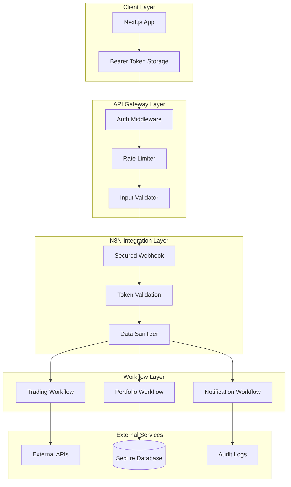

# N8N Integration Security Implementation Plan

## Overview

This document outlines the comprehensive security implementation for the N8N integration architecture, covering authentication, authorization, data protection, and monitoring strategies.

## Security Architecture



## 1. Authentication & Authorization

### Bearer Token Implementation

#### Token Generation
```typescript
// Generate cryptographically secure tokens
import crypto from 'crypto';

export function generateSecureToken(): string {
  return crypto.randomBytes(32).toString('hex');
}

// Example secure token
const API_INTEGRATION_TOKEN = "a1b2c3d4e5f6g7h8i9j0k1l2m3n4o5p6q7r8s9t0u1v2w3x4y5z6";
```

#### Environment Variables Security
```bash
# Production environment variables
N8N_API_INTEGRATION_TOKEN=a1b2c3d4e5f6g7h8i9j0k1l2m3n4o5p6q7r8s9t0u1v2w3x4y5z6
N8N_WEBHOOK_URL=https://secure-n8n.yourdomain.com
N8N_API_KEY=your-n8n-api-key-here

# Database credentials
SUPABASE_SERVICE_ROLE_KEY=your-service-role-key
SUPABASE_ANON_KEY=your-anon-key

# Trading API keys (encrypted at rest)
ALPACA_API_KEY_ENCRYPTED=encrypted-alpaca-key
BINANCE_API_KEY_ENCRYPTED=encrypted-binance-key
```

#### Token Validation in N8N

Enhanced validation code for the N8N webhook:

```javascript
// N8N Webhook Token Validation Node
const headers = $json.headers || {};
const body = $json.body || {};

// Extract and validate bearer token
const auth = headers.Authorization || headers.authorization;
const expectedToken = `Bearer ${$vars.API_INTEGRATION_BEARER_TOKEN}`;

// Security checks
if (!auth) {
  return [{
    json: {
      success: false,
      error: 'Missing Authorization header',
      statusCode: 401,
      timestamp: new Date().toISOString(),
      securityEvent: 'MISSING_AUTH_HEADER'
    }
  }];
}

if (auth !== expectedToken) {
  // Log security event
  console.warn('Invalid token attempt:', {
    providedToken: auth.substring(0, 20) + '...',
    timestamp: new Date().toISOString(),
    sourceIP: headers['x-forwarded-for'] || 'unknown'
  });
  
  return [{
    json: {
      success: false,
      error: 'Invalid or expired bearer token',
      statusCode: 401,
      timestamp: new Date().toISOString(),
      securityEvent: 'INVALID_TOKEN'
    }
  }];
}

// Token is valid, proceed with request processing
return [{
  json: {
    ...body,
    authValidated: true,
    validatedAt: new Date().toISOString()
  }
}];
```

### Token Rotation Strategy

#### Automated Token Rotation
```typescript
// lib/security/token-rotation.ts
export class TokenRotationManager {
  private static readonly ROTATION_INTERVAL = 30 * 24 * 60 * 60 * 1000; // 30 days
  
  static async rotateToken(): Promise<string> {
    const newToken = generateSecureToken();
    
    // Update environment variable
    await updateEnvironmentVariable('N8N_API_INTEGRATION_TOKEN', newToken);
    
    // Update N8N workflow variables
    await updateN8NVariable('API_INTEGRATION_BEARER_TOKEN', newToken);
    
    // Log rotation event
    await logSecurityEvent('TOKEN_ROTATED', {
      timestamp: new Date().toISOString(),
      previousTokenHash: hashToken(getCurrentToken()),
      newTokenHash: hashToken(newToken)
    });
    
    return newToken;
  }
  
  static scheduleRotation(): void {
    setInterval(async () => {
      try {
        await this.rotateToken();
        console.log('Token rotated successfully');
      } catch (error) {
        console.error('Token rotation failed:', error);
        // Send critical alert
        await sendCriticalAlert('Token rotation failed', error);
      }
    }, this.ROTATION_INTERVAL);
  }
}
```

## 2. Rate Limiting & DDoS Protection

### Next.js API Rate Limiting
```typescript
// middleware/rate-limiter.ts
import { NextRequest, NextResponse } from 'next/server';
import { Redis } from '@upstash/redis';

const redis = new Redis({
  url: process.env.REDIS_URL!,
  token: process.env.REDIS_TOKEN!
});

interface RateLimit {
  requests: number;
  resetTime: number;
}

export async function rateLimiter(
  request: NextRequest,
  limits: { requests: number; windowMs: number }
): Promise<NextResponse | null> {
  const clientId = getClientId(request);
  const key = `rate_limit:${clientId}`;
  const now = Date.now();
  
  const current = await redis.get<RateLimit>(key);
  
  if (!current || now > current.resetTime) {
    // Reset window
    await redis.set(key, {
      requests: 1,
      resetTime: now + limits.windowMs
    }, { ex: Math.ceil(limits.windowMs / 1000) });
    
    return null; // Allow request
  }
  
  if (current.requests >= limits.requests) {
    // Rate limit exceeded
    return NextResponse.json({
      success: false,
      error: 'Rate limit exceeded',
      statusCode: 429,
      retryAfter: Math.ceil((current.resetTime - now) / 1000)
    }, { 
      status: 429,
      headers: {
        'Retry-After': Math.ceil((current.resetTime - now) / 1000).toString(),
        'X-RateLimit-Limit': limits.requests.toString(),
        'X-RateLimit-Remaining': '0'
      }
    });
  }
  
  // Increment counter
  await redis.set(key, {
    requests: current.requests + 1,
    resetTime: current.resetTime
  }, { ex: Math.ceil((current.resetTime - now) / 1000) });
  
  return null; // Allow request
}

function getClientId(request: NextRequest): string {
  // Use API key or IP address as client identifier
  const authHeader = request.headers.get('Authorization');
  if (authHeader) {
    return hashToken(authHeader);
  }
  
  return request.ip || 
         request.headers.get('x-forwarded-for') || 
         'unknown';
}
```

### Rate Limiting Configuration
```typescript
// Rate limits by action type
export const RATE_LIMITS = {
  // High-impact trading actions
  trading: {
    requests: 10,
    windowMs: 60 * 1000 // 1 minute
  },
  
  // Market data requests
  marketData: {
    requests: 60,
    windowMs: 60 * 1000 // 1 minute
  },
  
  // Portfolio checks
  portfolio: {
    requests: 30,
    windowMs: 60 * 1000 // 1 minute
  },
  
  // Notifications
  notification: {
    requests: 30,
    windowMs: 60 * 1000 // 1 minute
  },
  
  // Default rate limit
  default: {
    requests: 100,
    windowMs: 60 * 1000 // 1 minute
  }
};
```

## 3. Input Validation & Sanitization

### Request Validation Schema
```typescript
// lib/validation/n8n-request-schema.ts
import Joi from 'joi';

export const n8nRequestSchema = Joi.object({
  action: Joi.string().valid(
    'execute_trade', 'get_market_data', 'manage_positions', 'create_strategy',
    'check_portfolio', 'assess_risk', 'get_performance', 'monitor_positions',
    'send_notification', 'create_alert', 'send_report', 'health_check'
  ).required(),
  
  workflow: Joi.string().valid('trading', 'portfolio', 'notification', 'auto').optional(),
  
  payload: Joi.object().required(),
  
  metadata: Joi.object({
    userId: Joi.string().alphanum().max(50),
    source: Joi.string().max(100),
    priority: Joi.string().valid('low', 'medium', 'high', 'critical')
  }).optional()
});

export const tradingPayloadSchema = Joi.object({
  symbol: Joi.string().uppercase().pattern(/^[A-Z]{3,10}$/).when('$action', {
    is: Joi.exist(),
    then: Joi.required(),
    otherwise: Joi.optional()
  }),
  
  side: Joi.string().valid('buy', 'sell').when('$action', {
    is: 'execute_trade',
    then: Joi.required(),
    otherwise: Joi.optional()
  }),
  
  quantity: Joi.number().positive().precision(8).when('$action', {
    is: 'execute_trade',
    then: Joi.required(),
    otherwise: Joi.optional()
  }),
  
  orderType: Joi.string().valid('market', 'limit', 'stop').default('market'),
  
  price: Joi.number().positive().when('orderType', {
    is: 'limit',
    then: Joi.required(),
    otherwise: Joi.optional()
  })
});
```

### Input Sanitization
```typescript
// lib/security/input-sanitizer.ts
export class InputSanitizer {
  static sanitizeString(input: string): string {
    return input
      .trim()
      .replace(/[<>]/g, '') // Remove potential HTML
      .replace(/['"]/g, '') // Remove quotes
      .substring(0, 1000); // Limit length
  }
  
  static sanitizeNumber(input: any): number | null {
    const num = parseFloat(input);
    if (isNaN(num) || !isFinite(num)) {
      return null;
    }
    return num;
  }
  
  static sanitizePayload(payload: any): any {
    if (typeof payload !== 'object' || payload === null) {
      throw new Error('Invalid payload type');
    }
    
    const sanitized: any = {};
    
    for (const [key, value] of Object.entries(payload)) {
      if (typeof value === 'string') {
        sanitized[key] = this.sanitizeString(value);
      } else if (typeof value === 'number') {
        sanitized[key] = this.sanitizeNumber(value);
      } else if (typeof value === 'boolean') {
        sanitized[key] = Boolean(value);
      } else if (Array.isArray(value)) {
        sanitized[key] = value.map(v => 
          typeof v === 'string' ? this.sanitizeString(v) : v
        );
      } else {
        // Skip complex objects or null values
        sanitized[key] = null;
      }
    }
    
    return sanitized;
  }
}
```

## 4. Data Encryption & Protection

### API Key Encryption
```typescript
// lib/security/encryption.ts
import crypto from 'crypto';

export class EncryptionManager {
  private static readonly algorithm = 'aes-256-gcm';
  private static readonly keyLength = 32;
  
  static encrypt(text: string, key: string): string {
    const cipher = crypto.createCipher(this.algorithm, key);
    const iv = crypto.randomBytes(16);
    
    cipher.setAAD(Buffer.from('n8n-integration'));
    
    let encrypted = cipher.update(text, 'utf8', 'hex');
    encrypted += cipher.final('hex');
    
    const authTag = cipher.getAuthTag();
    
    return `${iv.toString('hex')}:${encrypted}:${authTag.toString('hex')}`;
  }
  
  static decrypt(encryptedData: string, key: string): string {
    const [ivHex, encrypted, authTagHex] = encryptedData.split(':');
    
    const decipher = crypto.createDecipher(this.algorithm, key);
    const iv = Buffer.from(ivHex, 'hex');
    const authTag = Buffer.from(authTagHex, 'hex');
    
    decipher.setAAD(Buffer.from('n8n-integration'));
    decipher.setAuthTag(authTag);
    
    let decrypted = decipher.update(encrypted, 'hex', 'utf8');
    decrypted += decipher.final('utf8');
    
    return decrypted;
  }
}
```

### Secure API Key Storage
```typescript
// lib/security/credential-manager.ts
export class SecureCredentialManager {
  private static encryptionKey = process.env.CREDENTIAL_ENCRYPTION_KEY!;
  
  static getAlpacaCredentials(): { apiKey: string; secretKey: string } {
    const encryptedApiKey = process.env.ALPACA_API_KEY_ENCRYPTED!;
    const encryptedSecret = process.env.ALPACA_SECRET_KEY_ENCRYPTED!;
    
    return {
      apiKey: EncryptionManager.decrypt(encryptedApiKey, this.encryptionKey),
      secretKey: EncryptionManager.decrypt(encryptedSecret, this.encryptionKey)
    };
  }
  
  static getBinanceCredentials(): { apiKey: string; secretKey: string } {
    const encryptedApiKey = process.env.BINANCE_API_KEY_ENCRYPTED!;
    const encryptedSecret = process.env.BINANCE_SECRET_KEY_ENCRYPTED!;
    
    return {
      apiKey: EncryptionManager.decrypt(encryptedApiKey, this.encryptionKey),
      secretKey: EncryptionManager.decrypt(encryptedSecret, this.encryptionKey)
    };
  }
}
```

## 5. Audit Logging & Monitoring

### Security Event Logging
```typescript
// lib/security/audit-logger.ts
interface SecurityEvent {
  type: 'AUTH_SUCCESS' | 'AUTH_FAILURE' | 'RATE_LIMIT' | 'INVALID_INPUT' | 'SUSPICIOUS_ACTIVITY';
  timestamp: string;
  clientId: string;
  action?: string;
  details: Record<string, any>;
  severity: 'LOW' | 'MEDIUM' | 'HIGH' | 'CRITICAL';
}

export class SecurityAuditLogger {
  static async logEvent(event: SecurityEvent): Promise<void> {
    // Log to multiple destinations
    await Promise.all([
      this.logToDatabase(event),
      this.logToFile(event),
      this.sendToSecurity(event)
    ]);
    
    // Send alerts for high-severity events
    if (event.severity === 'HIGH' || event.severity === 'CRITICAL') {
      await this.sendSecurityAlert(event);
    }
  }
  
  private static async logToDatabase(event: SecurityEvent): Promise<void> {
    // Log to Supabase security_events table
    const { error } = await supabaseAdmin
      .from('security_events')
      .insert([event]);
    
    if (error) {
      console.error('Failed to log security event to database:', error);
    }
  }
  
  private static async logToFile(event: SecurityEvent): Promise<void> {
    const logEntry = `${event.timestamp} [${event.severity}] ${event.type}: ${JSON.stringify(event)}\n`;
    
    try {
      await fs.appendFile('logs/security.log', logEntry);
    } catch (error) {
      console.error('Failed to log security event to file:', error);
    }
  }
  
  private static async sendSecurityAlert(event: SecurityEvent): Promise<void> {
    // Send to security team via multiple channels
    await n8nClient.sendNotification({
      type: 'risk_alert',
      message: `Security Event: ${event.type} - ${event.details.description}`,
      channels: ['telegram', 'email'],
      priority: 'critical'
    });
  }
}
```

### Suspicious Activity Detection
```typescript
// lib/security/threat-detection.ts
export class ThreatDetectionManager {
  static async analyzeRequest(request: {
    clientId: string;
    action: string;
    payload: any;
    timestamp: string;
  }): Promise<{ threat: boolean; reason?: string }> {
    
    // Check for rapid successive requests
    const recentRequests = await this.getRecentRequests(request.clientId, 60000); // 1 minute
    if (recentRequests.length > 50) {
      return { threat: true, reason: 'Excessive request rate' };
    }
    
    // Check for unusual trading patterns
    if (request.action === 'execute_trade') {
      const quantity = request.payload.quantity;
      if (quantity > 10) { // Unusually large trade
        return { threat: true, reason: 'Unusually large trade quantity' };
      }
    }
    
    // Check for payload anomalies
    if (this.hasAnomalousPayload(request.payload)) {
      return { threat: true, reason: 'Anomalous payload structure' };
    }
    
    return { threat: false };
  }
  
  private static hasAnomalousPayload(payload: any): boolean {
    // Check for SQL injection attempts
    const sqlPatterns = /(\b(SELECT|INSERT|UPDATE|DELETE|DROP|UNION)\b)/i;
    const jsonString = JSON.stringify(payload);
    
    if (sqlPatterns.test(jsonString)) {
      return true;
    }
    
    // Check for script injection attempts
    const scriptPatterns = /<script|javascript:|vbscript:|on\w+=/i;
    if (scriptPatterns.test(jsonString)) {
      return true;
    }
    
    return false;
  }
}
```

## 6. Network Security

### HTTPS Enforcement
```typescript
// middleware/https-enforcement.ts
export function enforceHTTPS(request: NextRequest): NextResponse | null {
  const isHTTPS = request.headers.get('x-forwarded-proto') === 'https' || 
                  request.url.startsWith('https://');
  
  if (!isHTTPS && process.env.NODE_ENV === 'production') {
    const httpsUrl = request.url.replace('http://', 'https://');
    return NextResponse.redirect(httpsUrl, 301);
  }
  
  return null;
}
```

### IP Allowlisting
```typescript
// lib/security/ip-allowlist.ts
export class IPAllowlistManager {
  private static allowedIPs = [
    '127.0.0.1',
    '::1',
    // Add your N8N server IP
    process.env.N8N_SERVER_IP,
    // Add your deployment server IPs
    ...process.env.ALLOWED_IPS?.split(',') || []
  ].filter(Boolean);
  
  static isAllowed(clientIP: string): boolean {
    return this.allowedIPs.includes(clientIP);
  }
  
  static middleware(request: NextRequest): NextResponse | null {
    if (process.env.NODE_ENV !== 'production') {
      return null; // Skip in development
    }
    
    const clientIP = request.ip || 
                    request.headers.get('x-forwarded-for') || 
                    request.headers.get('x-real-ip');
    
    if (!clientIP || !this.isAllowed(clientIP)) {
      return NextResponse.json({
        success: false,
        error: 'Access denied from this IP address',
        statusCode: 403
      }, { status: 403 });
    }
    
    return null;
  }
}
```

## 7. Security Monitoring Dashboard

### Real-time Security Metrics
```typescript
// lib/monitoring/security-metrics.ts
export class SecurityMetricsCollector {
  static async getSecurityMetrics(): Promise<SecurityMetrics> {
    const last24Hours = new Date(Date.now() - 24 * 60 * 60 * 1000);
    
    const [
      authFailures,
      rateLimitHits,
      suspiciousActivity,
      successfulRequests
    ] = await Promise.all([
      this.countEvents('AUTH_FAILURE', last24Hours),
      this.countEvents('RATE_LIMIT', last24Hours),
      this.countEvents('SUSPICIOUS_ACTIVITY', last24Hours),
      this.countEvents('AUTH_SUCCESS', last24Hours)
    ]);
    
    return {
      authFailures,
      rateLimitHits,
      suspiciousActivity,
      successfulRequests,
      securityScore: this.calculateSecurityScore({
        authFailures,
        rateLimitHits,
        suspiciousActivity,
        successfulRequests
      }),
      lastUpdated: new Date().toISOString()
    };
  }
  
  private static calculateSecurityScore(metrics: any): number {
    const total = metrics.authFailures + metrics.rateLimitHits + 
                 metrics.suspiciousActivity + metrics.successfulRequests;
    
    if (total === 0) return 100;
    
    const securityEvents = metrics.authFailures + metrics.rateLimitHits + 
                          metrics.suspiciousActivity;
    
    return Math.max(0, 100 - (securityEvents / total) * 100);
  }
}

interface SecurityMetrics {
  authFailures: number;
  rateLimitHits: number;
  suspiciousActivity: number;
  successfulRequests: number;
  securityScore: number;
  lastUpdated: string;
}
```

## 8. Implementation Checklist

### Phase 1: Core Security (Immediate)
- [ ] Implement bearer token authentication in N8N webhook
- [ ] Set up environment variable encryption for API keys
- [ ] Configure HTTPS enforcement
- [ ] Implement basic rate limiting
- [ ] Set up audit logging

### Phase 2: Enhanced Protection (Week 1)
- [ ] Deploy input validation and sanitization
- [ ] Implement IP allowlisting
- [ ] Set up automated token rotation
- [ ] Configure threat detection
- [ ] Deploy security monitoring dashboard

### Phase 3: Advanced Security (Week 2)
- [ ] Implement anomaly detection
- [ ] Set up automated incident response
- [ ] Configure multi-factor authentication for admin access
- [ ] Deploy comprehensive security testing
- [ ] Establish security incident procedures

### Phase 4: Compliance & Audit (Ongoing)
- [ ] Security compliance verification
- [ ] Regular security audits
- [ ] Penetration testing
- [ ] Security training for team
- [ ] Incident response drills

## Security Configuration Summary

This security implementation provides:

1. **Multi-layer Authentication**: Bearer tokens with rotation
2. **Rate Limiting**: Prevents abuse and DDoS attacks
3. **Input Validation**: Comprehensive request sanitization
4. **Data Encryption**: Secure API key storage
5. **Audit Logging**: Complete security event tracking
6. **Threat Detection**: Real-time suspicious activity monitoring
7. **Network Security**: HTTPS enforcement and IP allowlisting
8. **Monitoring**: Real-time security metrics and alerting

The implementation ensures that your N8N integration maintains enterprise-level security standards while providing seamless operation for legitimate trading activities.